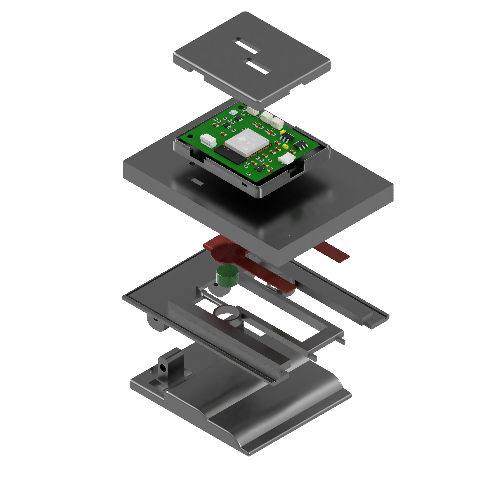

# Stress Logger – Smartphone-Based Acute Stress Monitoring System

  
  &nbsp;&nbsp;&nbsp;
  

## Overview

This project is a low-cost smartphone accessory designed to monitor acute stress using physiological signals.

## System Components

* ESP32 microcontroller
* MAX30102 (PPG sensor)
* Electrodermal Activity (EDA) circuit
* FSR sensors
* Android application

## Features

* Real-time physiological data acquisition
* USB communication with smartphone
* Live visualization
* CSV data logging

## Repository Structure

* firmware/
* android-app/
* pcb/
* docs
* enclosure_3d/
* docs/
* questionnaires
* raw_data/

## Author

Nicolás Ospitia – Universidad de los Andes
